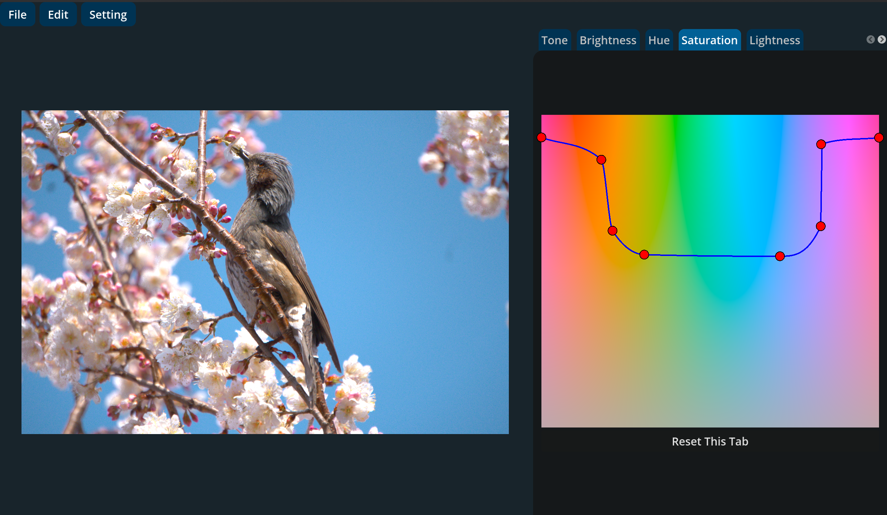

# RawPhotoForge
**High-performance & fast & Non-destructive RAW photo editor**



RawPhotoForge is a fully local RAW photo editing software.
The project was originally implemented in Python, but the **Rust version is now the latest and actively developed version**.

The Rust implementation is designed around **wgpu**, avoiding vendor-specific GPU APIs such as CUDA.
This ensures portability, performance, and long-term maintainability.

---

## Repository Structure

```

RawPhotoForge/
├── python-legacy/   # Legacy Python implementation (up to v0.5.0)
└── rust/            # Current Rust implementation (active development)

```

### python-legacy
- Original implementation
- Python-based
- Preserved for historical releases
- **No longer maintained**

### rust (Latest)
- Core: Rust
- GPU: wgpu (vendor-independent)
- UI: Godot Engine via GDExtension

---

## Rust Project Layout


```
rust/
├── photo-editor           # Core image processing library
├── photo-editor-godot     # Godot GDExtension wrapper
└── raw-photo-forge        # Godot project (UI)
```


- `photo-editor`
  - RAW image processing
  - GPU-based image operations
  - Metadata handling
- `photo-editor-godot`
  - Bridge between Rust core and Godot
- `raw-photo-forge`
  - User interface
  - Preview and interaction
  - Application settings

---

## License

### Project License
This project is licensed under the **GNU Affero General Public License v3.0 (AGPL-3.0)**.  
See the `LICENSE` file for details.

### Dependency Licenses (Rust)
Third-party Rust dependencies and their licenses are documented in:

- **`rust_licenses.html`**

This file is generated using `cargo-about`.

Example:
```bash
cargo about generate about.hbs > rust_licenses.html
```

---

## AI Tools Used
The development of RawPhotoForge is supported by the following AI tools:

- ChatGPT
- Gemini
- Gemini CLI
- Claude

---

## Godot Engine

* The UI is built using **Godot Engine**
* Rust and Godot are connected via **GDExtension**
* Godot Engine is licensed separately under the MIT License
  See the official Godot website for details


---


## Build from Source

RawPhotoForge consists of a Rust-based core and a Godot UI using GDExtension.
Below are the steps to build the project from source on Linux.

### Requirements

- Rust
- Cargo
- Godot Engine (standard version, .NET not required)
- Linux (tested on x86_64)

### Steps

```bash
git clone https://github.com/kingyo1205/RawPhotoForge.git
cd RawPhotoForge

# Build Rust GDExtension
cd rust/photo-editor-godot
cargo build --release

# Generate license information for Rust dependencies
cargo about init
cargo about generate about.hbs > rust_licenses.html

# Copy the generated shared library into the Godot addon directory
cd ../..
cp ./rust/photo-editor-godot/target/release/libphoto_editor_godot.so ./rust/raw-photo-forge/addons/photo_editor/
```

### Export with Godot

1. Open `rust/raw-photo-forge/` as a project in Godot
2. Make sure the GDExtension is loaded correctly
3. Use Godot’s export feature to build the final binary


---

## Notes

* Designed as a modern, open-source RAW editor
* Architecture is still evolving

---

## Project Status

* Python version: legacy (archived)
* Rust version: **active development (latest)**


