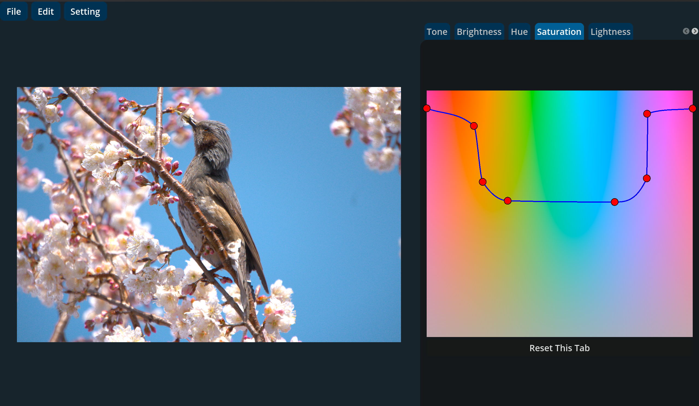

# RawPhotoForge

GPU Photo Editor Project



RawPhotoForgeはGPUアクセラレーションを活用した
写真編集プロジェクトです。

現在:
- WebGPUベースのWeb版
- Rust + GodotベースのDesktop版

を開発しています。

高速処理、非破壊編集、クロスプラットフォーム設計を重視しています。

---

## リポジトリ構成

```text
RawPhotoForge/
├── web/              # Web版
├── rust/             # Rust + Godot Desktop版
└── python-legacy/    # 旧Python版
```

### web
- WebGPUベース
- TypeScript
- ブラウザ動作
- 静的ホスティング

### rust
- コア: Rust
- GPU: wgpu
- UI: Godot Engine + GDExtension
- RAW対応

### python-legacy
- 初期実装
- Pythonベース
- 既存リリース保存用
- 現在は保守していません

---

## Projects

### RawPhotoForge Web

ブラウザベースのGPU写真編集アプリです。

#### 特徴

- WebGPUベース
- TypeScript
- 静的ホスティング
- インストール不要
- クロスプラットフォーム

#### 技術スタック

- TypeScript
- WebGPU

開発にdenoを使用しています。

---

### RawPhotoForge Desktop

Rust + Godotベースの
ネイティブRAW現像版です。

#### 特徴

- RAW対応
- Rust
- wgpu
- Godot Engine
- GDExtension
- GPUアクセラレーション
- 非破壊編集


#### Rust版の構成

```text
rust/
├── photo-editor           # 画像処理コア
├── photo-editor-godot     # Godot用GDExtension
└── raw-photo-forge        # Godotプロジェクト(UI)
```

##### photo-editor
- RAW画像処理
- GPU画像演算
- メタデータ処理

##### photo-editor-godot
- RustコアとGodotの接続層

##### raw-photo-forge
- UI
- プレビュー
- 各種設定

---

#### 技術スタック

- Rust
- wgpu
- Godot Engine
- GDExtension

---

#### Godot Engineについて

- UIは **Godot Engine** を使用
- Rustとは **GDExtension** で連携
- Godot Engine自体は MIT License で提供されています。詳細はGodot公式サイトを参照してください


---

#### ビルド方法

RawPhotoForge Desktopは、
Rustで実装されたコアと、
Godot(GDExtension)によるUIで構成されています。

以下はLinux環境でソースからビルドする手順です。

##### 必要環境

- Rust
- Cargo
- Godot Engine (通常版 .NET版不要)
- Linux (x86_64で動作確認)

##### 手順

```bash
git clone https://github.com/kingyo1205/RawPhotoForge.git
cd RawPhotoForge

# Rust GDExtension をビルド
cargo build -r -p photo-editor-godot

# 依存関係ライセンス情報の生成
cargo about init
cargo about generate about.hbs > rust_licenses.html

# 生成された共有ライブラリをGodotアドオンにコピー
cp ./target/release/libphoto_editor_godot.so ./rust/raw-photo-forge/addons/photo_editor/libs/Linux-x86_64/
```

##### Godotでのエクスポート

1. Godotで `rust/raw-photo-forge/` ディレクトリをプロジェクトとして開く
2. GDExtensionが正しく読み込まれていることを確認
3. Godotのエクスポート機能を使ってバイナリを生成

---

## ライセンス

### プロジェクト本体

本プロジェクトは
**GNU Affero General Public License v3.0 (AGPL-3.0)**
で公開しています。

詳細は `LICENSE` ファイルを参照してください。

### 依存関係のライセンス (Rust)

Rust版で使用している依存関係の
ライセンス一覧は以下にまとめています。

- `rust_licenses.html`

このファイルは
`cargo-about`
を使用して生成しています。

例:

```bash
cargo about generate about.hbs > rust_licenses.html
```

---

## 使用しているAIツール

RawPhotoForgeの開発では、
以下のAIツールを活用しています。

- ChatGPT
- Gemini
- Gemini CLI
- Claude

---

## Philosophy

- GPU accelerated
- GPU Vendor-free
- Cross platform
- Non-destructive editing
- Local-first
- Open source


---

## 注意事項

- 商用RAW現像ソフトの代替を目標に開発中
- 設計および実装は継続的に改善中

---

## 開発状況

- Python版: 開発終了
- Web版: 開発継続中
- Rust版: 開発継続中